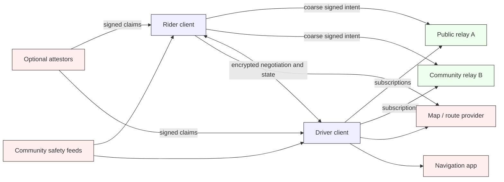
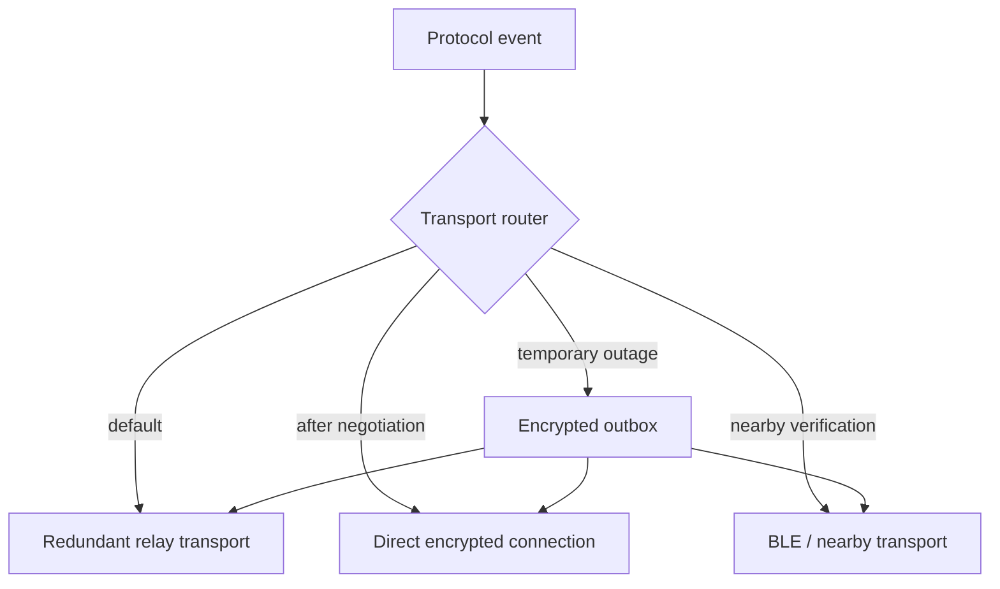
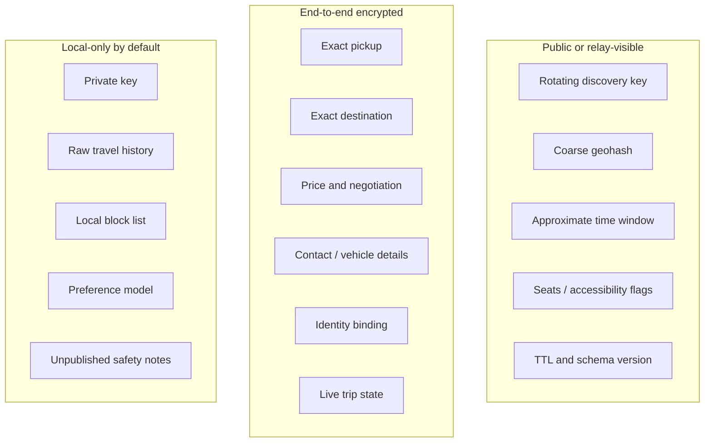

# PactRide Architecture

## Status

Draft architecture for discussion, aligned with the corrected v0.1 envelope and lifecycle. This document is descriptive; normative requirements belong in `PROTOCOL.md` and accepted RFCs.

## System context

## Architectural properties

- **Client-side matching:** relays distribute events; clients decide relevance and ranking.
- **Multi-relay publication:** important events are published to several relays.
- **End-to-end encryption:** exact trip information, identity bindings, and negotiation terms are encrypted between participants.
- **Local policy:** trust thresholds, moderation feeds, attestor acceptance, and participation rules are client or community decisions.
- **Transport independence:** the application layer uses a common message envelope across relay, direct, and nearby transports.
- **Portable evidence:** proof-backed receipts and attestations can be imported by another client.
- **No protocol tax:** the base architecture does not require one payment service, commission collector, or hosted API.

## Logical components

### 1. Identity manager

Responsibilities:

- Generate and store signing and encryption keys.
- Produce public identifiers and rotating discovery identifiers.
- Create and verify protocol `proofs[]` entries.
- Encrypt and decrypt private messages.
- Export encrypted backups.
- Process key rotation, device authorization, recovery statements, and private identity bindings.

Private keys must remain outside relay, map, notification, analytics, and hosted policy services. Hardware-backed storage should be used where available.

### 2. Local profile and policy store

Stores:

- User preferences.
- Driver availability and rider accessibility needs.
- Accepted relay sets.
- Trusted attestors.
- Local blocks and warnings.
- Ride history and receipts.
- Reputation evidence.
- Fee, ranking, and disclosure preferences.

This store should be encrypted at rest. Cloud synchronization, when offered, must be optional and encrypted before upload.

### 3. Discovery engine

Responsibilities:

- Publish TTL-bounded coarse ride requests or driver availability.
- Subscribe to relevant geohash cells and neighboring cells.
- Derive location precision from the geographic token rather than a conflicting numeric field.
- Deduplicate events arriving from multiple relays.
- Validate proofs, event IDs, versions, TTL, and public-event privacy constraints.
- Rank locally according to transparent user policy.

### 4. Negotiation engine

Responsibilities:

- Open an encrypted thread tied to one discovery event and one offer thread.
- Exchange complete terms rather than ambiguous diffs.
- Limit rounds and expiry.
- Require matching acceptance proofs over the same terms hash.
- Prevent contact and exact-location disclosure before intentional consent.
- Keep declined or expired offer threads separate from the ride aggregate.

### 5. Ride state machine

Maintains the ride-scoped sequence from request to cancellation, expiry, completion, dispute, or abnormal termination.

Each ride-scoped transition contains:

- a stable `ride_id`;
- deterministic `event_id`;
- causal `previous` references where applicable;
- `actor` and `created_at`;
- a typed payload;
- one or more proof entries;
- positive TTL when the event is expiring.

Non-ride events such as driver availability, identity attestations, credential revocations, and key rotation do not require fake ride IDs.

### 6. Transport router

Transport selection must not alter application semantics. Delivery acknowledgement is separate from ride-state acceptance or bilateral proof.

### 7. Map adapter

The protocol exchanges coordinates in encrypted contexts, coarse geohashes or equivalent cells for public discovery, and optional route hints. It does not prescribe a map vendor. Clients may use OpenStreetMap-based services, commercial APIs, offline maps, or external navigation applications.

### 8. Trust evaluator

Consumes evidence rather than a global score:

- Key age.
- Bilateral ride receipts.
- Distinct counterparties.
- Community attestations.
- Credential attestations.
- Disputes and warnings.
- Local blocks.

The evaluator must show users why a conclusion was reached and distinguish protocol evidence from local policy.

### 9. Service and fee disclosure

A compatible client may use paid maps, relays, payment processors, support, or other services. It should disclose:

- which service is used;
- what the service can observe;
- what fee is charged and to whom;
- whether ranking or routing is sponsored;
- how to choose a competing or self-hosted provider.

The protocol does not route a mandatory commission to PactRide maintainers.

## Data boundaries

## Trust boundaries

1. **User device boundary:** private keys and raw trip history are highest sensitivity.
2. **Relay boundary:** relays are untrusted for confidentiality and may censor, reorder, retain, or drop events.
3. **Counterparty boundary:** the rider or driver receives exact information only after negotiated disclosure and may still misuse it.
4. **Attestor boundary:** attestations are claims by issuers, not protocol truth.
5. **Map provider boundary:** route queries can reveal sensitive movement patterns.
6. **Nearby radio boundary:** BLE presence leaks physical proximity even when payloads are encrypted.
7. **Optional service boundary:** paid hosting, payment, notification, certification, or support must not silently become mandatory protocol infrastructure.

## Deployment modes

### Public mode

Clients use a user-visible list of public relays and discover unknown counterparties.

### Community mode

A cooperative, campus, neighborhood, or event uses its own relay and trust policy while remaining optionally interoperable with public relays.

### Direct relationship mode

Known riders and drivers exchange encrypted scheduled-ride messages without public discovery.

### Degraded/offline mode

Previously paired devices use nearby transport for verification and state updates. Store-and-forward discovery is experimental and must display weak delivery guarantees.

## Scalability approach

- Partition discovery by market, region, and geographic cell.
- Use short positive TTL values.
- Keep exact route information out of public filters.
- Deduplicate client-side across relays.
- Avoid global consensus.
- Use one ride aggregate plus separate bilateral offer threads.
- Treat reputation as independently verifiable evidence, not a globally recomputed ledger.

## Open architecture questions

- Which Nostr event kinds should PactRide request or reserve?
- What discovery-key rotation cadence balances privacy and usability?
- How should clients discover mutually supported relays?
- What is the minimum exact-location disclosure needed before acceptance?
- How should conflicting completion or abort evidence be presented across clients?
- What conformance requirements prevent clients from becoming incompatible silos?
- Which optional services can be recommended without creating a de facto mandatory stack?