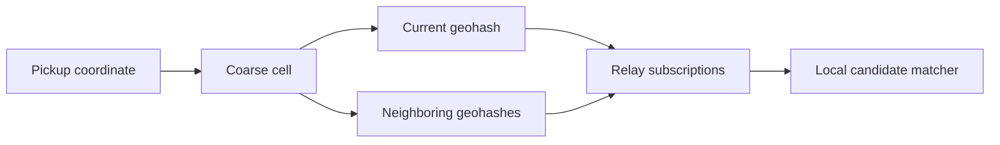

# Discovery and Matching

## Goal

Allow riders and drivers to discover relevant counterparties without a mandatory central dispatcher and without publicly exposing exact travel plans.

## Public discovery model

Riders publish short-lived `ride.request` events. Drivers may publish short-lived `driver.availability` events. Relays distribute events; clients validate and rank them locally.

A public ride request MUST be validated as a complete envelope with `schemas/public-ride-request-event.schema.json`. Payload-only validation is insufficient because privacy-sensitive data could otherwise be smuggled into undeclared envelope fields.

## Geographic partitioning

The initial proposal uses geohashes or equivalent cells:

- Public pickup: neighborhood-scale precision.
- Public destination: optional neighborhood/zone precision.
- Exact coordinates: encrypted only.
- Clients subscribe to the current cell and neighboring cells.

## Geohash precision

Precision is derived from the geohash string length.

Clients MUST NOT accept a separate numeric precision field. This prevents one client from displaying or matching at one granularity while another interprets the same token differently.

Neighbor expansion MUST use the derived precision.

## Matching inputs

A local matcher may consider:

- Pickup-zone distance.
- Destination direction or zone.
- Derived time window.
- Seat count.
- Accessibility requirements.
- Luggage.
- Vehicle category.
- Fare bounds.
- Trust-policy result.
- User favorites or previous counterparties.
- Relay freshness and delivery confidence.

Clients should disclose ranking factors. Paid placement or sponsored ranking must be visibly identified.

## Public request privacy budget

Each public field should be justified by matching value. Implementations should support profiles:

### Minimal

- Pickup zone.
- `not_before` plus `duration_seconds`.
- Seat count.
- Positive TTL.

### Directional

Adds destination zone or direction.

### Accessibility-aware

Adds only required accessibility features, avoiding unnecessary medical detail.

### Scheduled known-counterparty

No public event; encrypted direct request.

## Time windows and expiry

A request window is represented by:

- `not_before`
- Positive `duration_seconds`

The derived end is `not_before + duration_seconds`.

Event expiry is represented by positive `ttl_seconds`, with effective expiry `created_at + ttl_seconds`.

These representations cannot encode a reversed ride window or expiry before creation.

## Availability events

Drivers may announce:

- Operating zone.
- Availability start and duration.
- Seats or vehicle category.
- Accepted ride types.
- Coarse destination preference.
- Positive TTL.

Availability events are not inherently ride-scoped and remain valid without `ride_id`.

Availability must not publish continuous exact driver location.

## Matching is not dispatch

A match is a local candidate. A ride exists only after encrypted offer and bilateral acceptance. Relays and matchers must not silently commit users.

## Sparse-network behavior

When no match exists, clients may:

- Expand neighboring cells gradually.
- Extend the time window with user consent.
- Query additional relays.
- Notify favored drivers directly.
- Queue the request for bounded retry.

The UI must show when search scope expands and what additional information becomes visible.

## Abuse controls

- Short positive TTL.
- Per-key rate limits.
- Local spam scoring.
- Optional relay proof-of-work.
- Community allowlists.
- No contact details in public requests.
- No public extension object in v0.1.
- Negotiation caps.

## Fairness concerns

Local ranking can still create discrimination or hidden platform power. Compatible clients should:

- Make ranking factors inspectable.
- Avoid required protected-characteristic fields.
- Permit manual chronological or distance-based views.
- Identify community policy separately from protocol.
- Publish paid or sponsored influence.

## Test scenarios

1. Rider and driver on opposite sides of a geohash boundary still match.
2. Expired request is not surfaced.
3. Duplicate request from five relays appears once.
4. Exact coordinates in a public request are rejected.
5. A separate geohash precision field is rejected.
6. Legacy `earliest`/`latest` windows are rejected.
7. Public top-level additions and `extensions` are rejected.
8. A non-ride availability event works without `ride_id`.
9. A trust policy can exclude a candidate without altering relay data.
10. Search expansion requires explicit user awareness.
