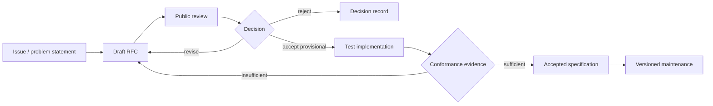

# Governance

## Purpose

PactRide governance exists to keep the protocol coherent while preventing permanent control by the original founder, a company, a token holder group, or one implementation.

## Current stage

During the research-RFC stage, **`wpggLabs` is the current maintainer**. This is a temporary coordination and stewardship role, not ownership of the protocol, compatible implementations, transportation operations, or every use of the PactRide idea.

The project is maintained at limited capacity. Governance procedures describe how decisions should be made when qualified contributors are active; they do not imply a staffed standards body or continuous review availability.

Current stewardship and succession are recorded in [`MAINTAINERS.md`](MAINTAINERS.md). Maintenance expectations, inactivity, archival, and restart conditions are recorded in [`MAINTENANCE.md`](MAINTENANCE.md).

## Decision principles

- Technical claims require evidence.
- Safety and privacy objections receive priority over convenience.
- Interoperability takes priority over one client's implementation preference.
- Decisions and dissent are recorded publicly.
- No token voting.
- No payment for protocol influence.
- Commercial and nonprofit implementations may participate equally.
- Driver and rider experience is treated as domain expertise, not secondary feedback.
- Limited maintainer capacity must not be misrepresented as active product development.

## RFC lifecycle

### 1. Problem issue

An RFC starts with a problem, not a preferred technology. The issue must describe affected users, failure mode, scope, and why existing protocol behavior is insufficient.

### 2. Draft

A draft includes:

- Motivation.
- Normative behavior.
- Data model.
- Privacy and threat analysis.
- Compatibility impact.
- Alternatives.
- Test plan.
- Migration path.
- Unresolved questions.

### 3. Review

Minimum review periods should be seven days for small changes and twenty-one days for protocol or security changes once the project has multiple active reviewers.

When only one maintainer is active, a change may remain open longer. Lack of review does not imply approval.

### 4. Provisional acceptance

A design may be accepted provisionally for test implementation. Provisional status is not a stable standard and must not be marketed as production-ready.

### 5. Final acceptance

Final acceptance should require:

- at least two maintainer approvals when two active maintainers exist;
- no unresolved critical security objection;
- conformance tests;
- at least one implementation, with two independent implementations for major interoperability changes;
- a written decision record.

Until maintainer diversity and implementation evidence exist, protocol material remains draft or provisional.

## Maintainer model

### Current maintainer

The current maintainer coordinates the repository, keeps claims aligned with evidence, and recruits reviewers and successors. This stewardship role does not create permanent technical control.

### Adding maintainers

A contributor may become a maintainer after sustained work that demonstrates:

- accurate technical judgment;
- respect for the project's principles;
- constructive review behavior;
- ability to document tradeoffs;
- attention to safety, privacy, accessibility, and interoperability;
- no pattern of hiding conflicts of interest.

Addition requires public nomination and approval by two existing maintainers once that is possible. While only one maintainer exists, the current maintainer may invite a new maintainer after documenting the basis publicly.

### Removing or marking maintainers inactive

Grounds include:

- security abuse;
- harassment;
- undisclosed financial conflict affecting decisions;
- repeated unilateral protocol changes;
- extended inactivity combined with blocked succession.

Operational details and inactive-maintainer treatment are defined in `MAINTAINERS.md`.

## Decision authority

| Decision | Required process |
|---|---|
| Typo or clarification | Maintainer review |
| Non-normative documentation | Pull request or documented direct review |
| Additive schema field | RFC-lite and tests |
| New event type | Full RFC |
| Breaking protocol change | Full RFC, migration plan, major version |
| Cryptographic primitive change | Full RFC and independent security review |
| Governance change | Public proposal and supermajority of active maintainers when multiple maintainers exist |
| Production-readiness or safety claim | Evidence plus domain review |
| Real pilot proposal | Technical, legal, operational, privacy, accessibility, and insurance review |

## Conflicts of interest

Contributors must disclose when they represent or are paid by:

- a ride platform;
- relay operator;
- identity or verification vendor;
- payment provider;
- mapping provider;
- insurance or regulatory organization;
- token or cryptocurrency project;
- grant sponsor or pilot operator with a material interest in the decision.

Participation is allowed; hidden influence is not.

## Fork rights

The Apache-2.0 license allows forks and commercial implementations. A fork may truthfully describe protocol compatibility when accurate. The project should not use trademarks to block truthful compatibility claims or turn certification into a hidden permission system.

## Founder succession

The founder should not remain a required signer, relay operator, domain owner, release gate, or protocol authority. Before a stable specification:

- at least three active maintainers should be a target;
- release signing should use multiple keys or a transparent process;
- domains and communication channels should have documented succession;
- test infrastructure should be reproducible;
- governance history should remain in the repository;
- repository, website, security, trademark, and funding records should have a documented transfer path.

## Appeals

Protocol decisions may be challenged with new evidence, implementation results, security findings, or demonstrated user harm. Popularity alone is not sufficient reason to break compatibility.
