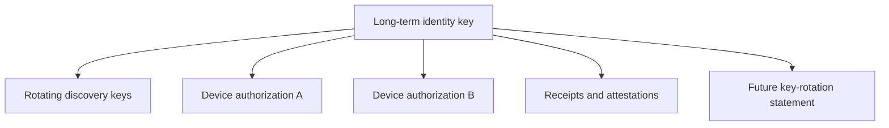

# Identity

## Base identity

PactRide identities are cryptographic keypairs controlled by users. The initial profile should reuse a mature signing ecosystem such as Nostr-compatible secp256k1 keys rather than inventing a new cryptographic identity format.

## What identity proves

A valid proof shows that the holder of a private key authorized one exact event ID. It does not prove a legal name, age, driving credential, vehicle ownership, safety history, payment, or physical presence.

## Key roles

A client may use separate keys for:

- Long-term identity and portable history.
- Rotating public discovery.
- Device-specific sessions.
- Backup encryption.
- Temporary message wrapping.

Separation reduces correlation and limits compromise impact.



## Storage requirements

Reference clients should:

- Use Android Keystore or Apple Keychain where available.
- Prefer hardware-backed non-exportable keys for daily signing.
- Encrypt exported recovery material.
- Never log private keys or decrypted backup phrases.
- Require explicit confirmation before exposing an export.
- Support device revocation.

## Recovery

No recovery method is perfect.

### Encrypted user backup

The user exports encrypted key material protected by a strong passphrase. This is the simplest portable method but depends on user custody.

### Multi-device authorization

An existing authorized device signs a new device authorization. Device keys can be revoked without rotating the root identity.

### Social/community recovery

Trusted parties or a community attest that a replacement key belongs to the same participant. This is a claim, not cryptographic proof of continuity, when the old key is unavailable.

## Rotation

A preferred `key.rotation` event uses the ordinary strict envelope and two explicit proofs:

```json
{
  "protocol": "pactride",
  "version": "0.1",
  "type": "key.rotation",
  "event_id": "sha256:...",
  "actor": "pubkey:old",
  "created_at": 1783742400,
  "payload": {
    "old_key": "pubkey:old",
    "new_key": "pubkey:new",
    "effective_at": 1783742400,
    "reason": "scheduled"
  },
  "proofs": [
    {
      "signer": "pubkey:old",
      "algorithm": "schnorr-secp256k1",
      "signature": "..."
    },
    {
      "signer": "pubkey:new",
      "algorithm": "schnorr-secp256k1",
      "signature": "..."
    }
  ]
}
```

`key.rotation` is not ride-scoped and does not require `ride_id`.

Both proofs provide strong continuity. When the old key is lost, clients should show weaker recovery evidence and preserve the distinction.

## Device compromise

A compromised key may authorize apparently valid events. Responses include:

- Device revocation.
- Root-key rotation.
- Community warning or revocation attestations.
- Local invalidation after a known compromise timestamp.

The protocol cannot erase events already copied by relays or counterparties.

## Identity attestations

Attestations should contain narrowly scoped claims and expiration. Avoid embedding government documents or raw personal data. Examples:

- “Issuer checked a government ID in person.”
- “Issuer observed vehicle VIN ending 1234 on date X.”
- “Subject is an active member of cooperative Y through date Z.”

Identity and vehicle attestations are not inherently ride-scoped and remain valid without `ride_id`.

## Discovery-key unlinkability

A rotating discovery key MUST NOT publicly reveal its long-term identity.

When a selected counterparty needs the long-term identity, the rider sends one encrypted `identity.binding` event that includes:

- The public request event ID.
- The rotating discovery key.
- The long-term identity key.
- The ride ID.
- A limited scope, normally `single-ride`.
- A bounded lifetime.
- One proof from each key over the same event ID.

The counterparty MUST verify both proofs before accepting a later event authored by the long-term key as belonging to the same rider for that ride.

The binding MUST remain encrypted. Republishing it publicly would defeat rotating-key privacy.

Public reputation previews may use selective disclosures or community-issued short-lived credentials in later versions.

## Multiple personas

Users may maintain separate identities. The base protocol cannot prevent this. Clients should not claim that one device equals one human.

## Open questions

- Nostr keys, DIDs, or a minimal PactRide identifier profile?
- How frequently should discovery keys rotate?
- How can portable reputation be selectively disclosed without linking all public requests?
- Should root identities sign device certificates rather than every event?
- Which recovery methods are acceptable for high-trust communities?
