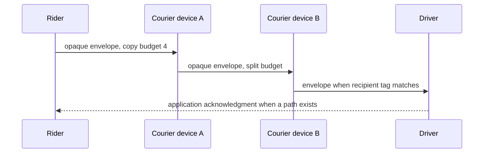

# Offline and Mesh Research Track

## Position

PactRide should not depend on a citywide Bluetooth mesh. Internet relays are the practical primary transport. Nearby networking is valuable for pickup verification, short-range coordination, temporary outages, disaster scenarios, and experimental store-and-forward delivery.

## Why pure mesh is insufficient

Ordinary phones do not provide dependable always-on routing because:

- Bluetooth range is limited and environment-dependent.
- Sparse participation creates disconnected islands.
- Mobile operating systems suspend background work.
- Continuous scanning drains battery.
- Users revoke permissions or disable radios.
- Message flooding becomes expensive in dense areas.
- A chain of unknown devices cannot guarantee latency or delivery.

## Research stages

### Stage 1: bilateral pickup channel

Two previously matched clients exchange an authenticated challenge over BLE or a nearby-device API.

Success criteria:

- Works without internet at pickup.
- Binds both identity keys and ride ID.
- Prevents replay across rides.
- Uses rotating radio identifiers.
- Completes within a practical time and battery budget.

### Stage 2: direct trip-state fallback

Paired rider and driver devices exchange arrival, start, cancellation, and completion messages when relay access is lost.

### Stage 3: one-hop opportunistic forwarding

A trusted or policy-eligible nearby device carries encrypted messages to a known recipient. The courier cannot read content.

### Stage 4: bounded multi-hop experimentation

Only after measured success, test controlled forwarding with:

- TTL limits.
- Deduplication cache.
- Random jitter.
- Strict message size.
- Copy budgets.
- Per-origin quotas.
- Expiration.
- Encrypted payloads.
- User-visible battery policy.

## Proposed transport packet

```text
version | packet_type | ttl | created_at | expires_at
message_id | source_ephemeral_id | recipient_tag?
payload_length | encrypted_payload | signature?
```

The forwarding header must not reveal exact ride locations or long-term identity where avoidable.

## Delivery model



## Threats

- Radio tracking.
- Battery exhaustion.
- Flooding.
- Malicious couriers dropping messages.
- Correlation of recipient tags.
- Replay.
- Oversized payload attacks.
- False assumptions of delivery.

## Required UX

Clients must distinguish:

- Nearby peer detected.
- Message handed to courier.
- Recipient device received ciphertext.
- Recipient decrypted message.
- Application state accepted.

“Carried by mesh” must never be shown as “driver accepted.”

## Metrics

Experiments should collect privacy-preserving local metrics:

- Discovery latency.
- Delivery success by hop count.
- Battery impact.
- Duplicate ratio.
- Queue expiry rate.
- Background survival.
- Device/OS compatibility.

Raw identity, route, or exact-location telemetry must not be required.

## Explicit non-goal

The project will not delay protocol interoperability or the first relay-based reference implementation while pursuing generalized mesh networking.
