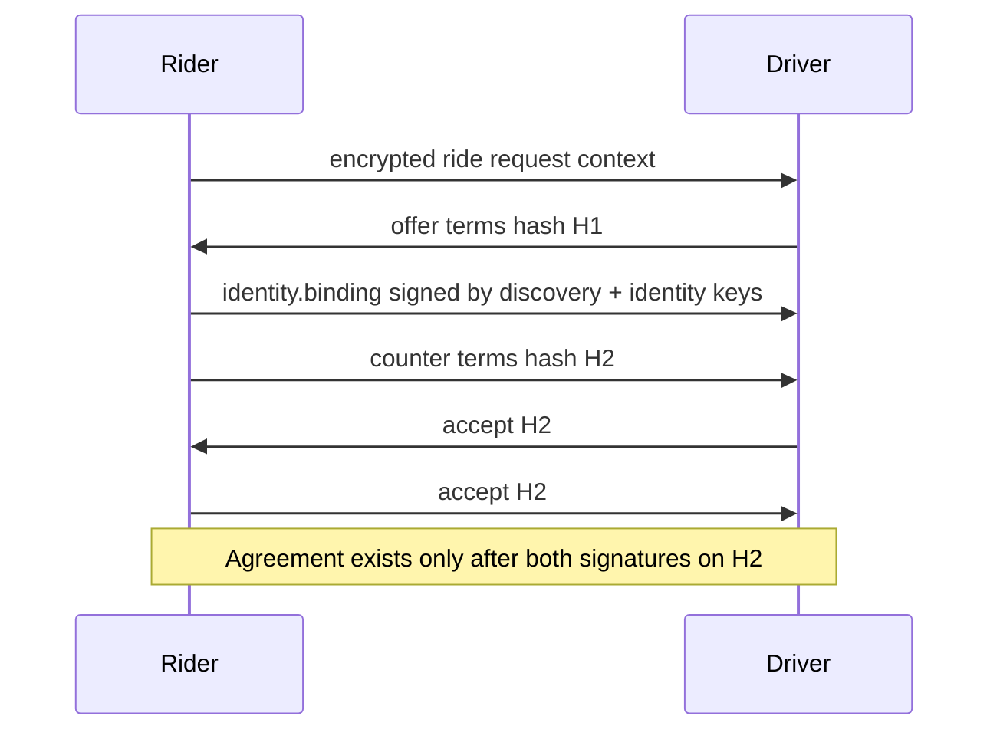

# PactRide Protocol Draft v0.1

## Status and terminology

This is a pre-implementation RFC draft.

The key words **MUST**, **MUST NOT**, **REQUIRED**, **SHOULD**, **SHOULD NOT**, and **MAY** are used in the sense of RFC 2119/8174 when written in uppercase.

The wire model in this revision incorporates the current public review cases and conformance artifacts. It intentionally favors representations that cannot encode contradictory values.

## Scope

The base protocol defines:

- Identity references.
- Public discovery events.
- Encrypted negotiation envelopes.
- Bilateral acceptance.
- Ride-state transitions.
- Completion receipts.
- Ratings and attestations.
- Versioning and interoperability behavior.

The base protocol does not define mandatory payment rails, map providers, insurance, emergency response, or universal identity verification.

## Common event envelope

Every protocol event MUST use this logical envelope:

```json
{
  "protocol": "pactride",
  "version": "0.1",
  "type": "ride.request",
  "event_id": "sha256:...",
  "actor": "did:key-or-nostr-pubkey",
  "created_at": 1783742400,
  "ttl_seconds": 600,
  "ride_id": "01J...",
  "previous": ["sha256:..."],
  "payload": {},
  "proofs": [
    {
      "signer": "did:key-or-nostr-pubkey",
      "algorithm": "schnorr-secp256k1",
      "signature": "..."
    }
  ]
}
```

### Field rules

- `protocol`, `version`, `type`, `event_id`, `actor`, `created_at`, `payload`, and `proofs` are required for every event.
- `actor` identifies the primary author and MUST have a valid proof in `proofs`.
- `ride_id` is REQUIRED only for ride-scoped events.
- `ride_id` MUST NOT be invented for identity, credential, moderation, or general availability events.
- `ttl_seconds` is REQUIRED for expiring public events.
- Effective expiry is `created_at + ttl_seconds`.
- `ttl_seconds` MUST be positive; therefore expiry cannot precede creation.
- `previous` references the event or events on which the new event causally depends.
- Top-level fields not defined by the envelope MUST be rejected.
- Non-public extensions MAY appear only inside a namespaced `extensions` object.
- Public discovery events in v0.1 MUST NOT include `extensions`.

## Canonical event ID and signing input

PactRide v0.1 uses RFC 8785 JSON Canonicalization Scheme and SHA-256.

The **signing object** is the complete event envelope with exactly these generated fields omitted:

- `event_id`
- `proofs`

No placeholder is inserted for an omitted field.

The event ID algorithm is:

1. Remove `event_id` and `proofs`.
2. Canonicalize the remaining JSON object using RFC 8785.
3. Hash the UTF-8 canonical bytes using SHA-256.
4. Encode the digest as lowercase hexadecimal.
5. Prefix it with `sha256:`.

Formally:

```text
event_id = "sha256:" + hex_lower(SHA256(JCS(signing_object)))
```

Every signature proof MUST sign the raw 32-byte SHA-256 digest represented by `event_id`, not the printable `sha256:` string.

A verifier MUST:

1. Reconstruct the signing object.
2. Recompute the event ID.
3. Reject the event if the recomputed ID differs.
4. Verify every proof against the recomputed digest.
5. Reject duplicate signer entries.
6. Verify that the primary `actor` appears exactly once in `proofs`.

Unknown fields cannot silently influence one implementation but not another because undeclared top-level fields are invalid.

See `test-vectors/event-id-v0.1.json`.

## Signature proofs

`proofs` is an array so the same envelope can represent one-author and bilateral events.

```json
"proofs": [
  {
    "signer": "npub-rider",
    "algorithm": "schnorr-secp256k1",
    "signature": "..."
  },
  {
    "signer": "npub-driver",
    "algorithm": "schnorr-secp256k1",
    "signature": "..."
  }
]
```

For ordinary events:

- At least one valid proof is required.
- The primary `actor` MUST be one of the signers.

For `pickup.proof` and `ride.completed.receipt`:

- The signer set MUST contain exactly the rider and driver keys frozen in accepted terms.
- Both proofs MUST cover the same event ID.
- Two separately signed but non-identical payloads do not form a bilateral proof.

For `identity.binding`:

- The signer set MUST contain both the discovery key and the long-term identity key.
- The binding is valid only for its declared scope and expiry.

Aggregate cryptographic signatures may be standardized later, but v0.1 interoperability uses explicit proof entries.

## Event families

### Public discovery

- `ride.request`
- `driver.availability`
- `ride.withdraw`

### Private negotiation

- `ride.offer`
- `ride.counter`
- `identity.binding`
- `ride.accept`
- `ride.decline`
- `ride.cancel`

### Ride execution

- `driver.departing`
- `driver.arrived`
- `pickup.challenge`
- `pickup.proof`
- `ride.started`
- `ride.progress`
- `ride.abort`
- `ride.completed.claim`
- `ride.completed.receipt`
- `ride.disputed`

### Trust and reputation

- `ride.rating`
- `identity.attestation`
- `vehicle.attestation`
- `credential.revocation`
- `key.rotation`
- `moderation.warning`

## Ride scope

The following event families are ride-scoped and require `ride_id`:

- Requests, withdrawals, offers, counters, bindings, acceptances, declines, and cancellations.
- Driver departure and arrival.
- Pickup challenge and proof.
- Ride start, progress, abort, completion, dispute, and rating.

The following events are not inherently ride-scoped and MUST remain valid without `ride_id`:

- `driver.availability`
- `identity.attestation`
- `vehicle.attestation`
- `credential.revocation`
- `key.rotation`
- `moderation.warning`

An attestation MAY reference a ride receipt inside its payload, but that does not make the envelope itself part of the ride state machine.

## Public ride request

A public request MUST be validated as a whole using:

`schemas/public-ride-request-event.schema.json`

The request carries only coarse discovery information:

```json
{
  "type": "ride.request",
  "ride_id": "01JPACTRIDE...",
  "ttl_seconds": 600,
  "payload": {
    "pickup": {
      "geohash": "dr5x1"
    },
    "destination": {
      "geohash": "dr5ru"
    },
    "window": {
      "not_before": 1783742700,
      "duration_seconds": 900
    },
    "party": {
      "seats": 1,
      "wheelchair_accessible_required": false,
      "service_animal": false,
      "luggage": "small"
    },
    "terms_hint": {
      "currency": "USD",
      "maximum": "35.00",
      "negotiable": true
    }
  }
}
```

### Location precision

Geohash precision is the geohash string length. A separate numeric precision field is forbidden because it can contradict the actual location token.

Clients MUST:

- Derive precision from `length(geohash)`.
- Apply neighbor-cell matching using that derived precision.
- Display the actual derived granularity to users.

### Ride window

The public time window is represented as:

- `not_before`: earliest acceptable Unix timestamp.
- `duration_seconds`: positive duration.

The derived latest time is:

```text
not_after = not_before + duration_seconds
```

A reversed range cannot be represented.

### Public privacy boundary

Public request envelopes MUST NOT contain:

- Exact street address.
- Apartment or room number.
- Phone number.
- Legal name.
- Continuous location.
- Exact destination coordinates.
- Unencrypted free-form notes containing personal information.
- An `extensions` object.
- Any undeclared top-level field.

A relay or client MUST validate the full envelope, not only `payload`.

## Driver offer

Offers are encrypted to the rider and SHOULD contain complete proposed terms:

```json
{
  "type": "ride.offer",
  "ride_id": "01JPACTRIDE...",
  "payload": {
    "offer_id": "01JOFFER...",
    "pickup_eta_seconds": 420,
    "terms": {
      "amount": "28.00",
      "currency": "USD",
      "settlement_methods": ["cash", "external-transfer"]
    },
    "vehicle_summary": {
      "category": "compact-suv",
      "seats_available": 3
    },
    "evidence_refs": ["event:attestation-1"]
  }
}
```

## Discovery-to-identity binding

A rotating discovery key protects public request linkability. A long-term key MUST NOT replace it silently.

Before a counterparty relies on a long-term identity, the rider sends an encrypted `identity.binding` event containing:

```json
{
  "type": "identity.binding",
  "ride_id": "01JPACTRIDE...",
  "payload": {
    "request_event_id": "sha256:...",
    "discovery_key": "npub-discovery-7",
    "identity_key": "npub-rider-A",
    "scope": "single-ride",
    "valid_for_seconds": 1800
  },
  "proofs": [
    {"signer": "npub-discovery-7", "algorithm": "schnorr-secp256k1", "signature": "..."},
    {"signer": "npub-rider-A", "algorithm": "schnorr-secp256k1", "signature": "..."}
  ]
}
```

The driver MUST verify both proofs before accepting the long-term key as the rider identity for that ride. The binding MUST remain encrypted and MUST NOT be republished as public discovery data.

## Negotiation

- Every counter MUST restate all currently proposed terms.
- Clients SHOULD cap negotiation rounds.
- A final acceptance MUST reference the exact hash of the accepted terms.
- A ride becomes `Accepted` only after both parties sign the same terms hash.
- Crossing counters and accepts MUST NOT silently create agreement.
- Declining one offer closes only that offer thread.
- Request expiry closes all unaccepted negotiation threads.



## Exact-location disclosure

Exact pickup and destination information MUST use an encrypted channel. Clients SHOULD disclose exact pickup only after intentional counterparty acceptance or a clear local policy threshold.

Destination disclosure MAY be delayed until pickup for privacy-sensitive use cases, provided the driver knowingly accepts that policy.

## Pickup verification

The protocol SHOULD support:

1. One client generates a random challenge.
2. The challenge is displayed as QR and a short phrase.
3. The other device scans or enters it.
4. Both clients sign one identical `pickup.proof` event.
5. The event binds ride ID, accepted participant keys, challenge hash, method, and timestamp.
6. The ride may transition to `Started` only after policy-required proof exists.

BLE proximity MAY supplement the flow but MUST NOT be treated as strong identity proof alone.

## Cancellation and abnormal termination

`ride.cancel` applies before pickup verification.

`ride.abort` applies after pickup verification or after the ride starts. It MUST contain:

- The current state reference.
- The actor.
- Timestamp.
- Machine-readable reason category.
- Whether immediate assistance was requested through an external system.
- Optional encrypted note.

An abort is a signed claim, not proof of fault. Conflicting abort and completion events transition the aggregate to `Disputed`.

## Completion

One-sided completion is a claim, not a receipt.

- Either party MAY publish `ride.completed.claim`.
- `ride.completed.receipt` requires rider and driver proofs over one identical event.
- Clients MUST visually distinguish bilateral receipts from unilateral claims.
- A disagreement SHOULD become `ride.disputed` without deleting evidence.

The protocol MUST NOT claim that signatures prove physical safety, route quality, or irreversible payment.

## Ratings

A rating SHOULD reference a bilateral completion receipt. Ratings tied only to unilateral claims MUST be labeled lower-confidence evidence.

Suggested dimensions:

- Reliability.
- Communication.
- Pickup accuracy.
- Vehicle or rider conduct.
- Accessibility accommodation.

Free-form text MUST be treated as potentially sensitive and harmful content.

## Key rotation

A key rotation event SHOULD contain proofs from old and new keys. Clients MAY carry evidence forward while preserving original signatures and displaying the rotation chain.

Loss of the old key cannot be cryptographically proven. Recovery attestations remain third-party claims.

## Expiration and replay

- Public requests SHOULD use a TTL measured in minutes.
- Effective expiry is `created_at + ttl_seconds`.
- Clients MUST reject `ttl_seconds <= 0`.
- Clients MUST reject expired events for live state, while MAY retaining them for archival evidence.
- Negotiation messages SHOULD expire with the request unless accepted.
- Clients MUST deduplicate by event ID.
- Relays MAY retain events after expiry; clients enforce expiry independently.
- Integer addition MUST be checked for overflow.

## Conflict handling

When valid events conflict:

- Preserve both.
- Do not choose by relay arrival order.
- Apply `RIDE_LIFECYCLE.md`.
- Show unresolved conflict when no deterministic bilateral rule applies.

## Conformance

An implementation claiming PactRide v0.1 compatibility MUST eventually pass:

1. Canonical serialization and event-ID vectors.
2. Signature-proof validation vectors.
3. Whole-envelope public privacy validation.
4. Ride-scope validation.
5. Negotiation crossing-message tests.
6. State-machine transition tests.
7. Replay and TTL tests.
8. Multi-relay deduplication tests.
9. Import/export receipt tests.
10. Independent-client end-to-end simulation.

Every named v0.1 event family is constrained by `schemas/protocol-event-types.schema.json`; representative valid and invalid events are in `test-vectors/protocol-event-types-v0.1.json`. Executable aggregate-state scenarios are in `test-vectors/lifecycle-v0.1.json`.

Normative semantic checks not expressible in portable JSON Schema are listed in `schemas/SEMANTIC_VALIDATION.md`.

## Extension process

New top-level fields require a protocol-version change. Compatible private extensions MUST use the `extensions` object and a reverse-domain-style namespace. Public discovery extensions require an RFC, privacy analysis, schema update, and conformance vectors.
