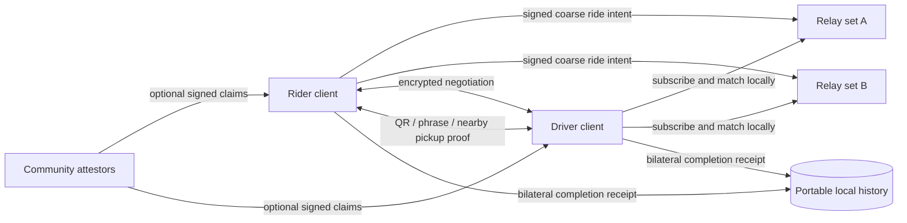
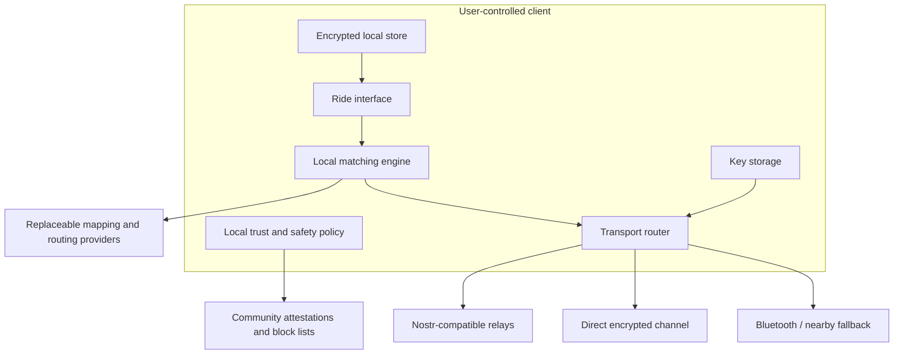
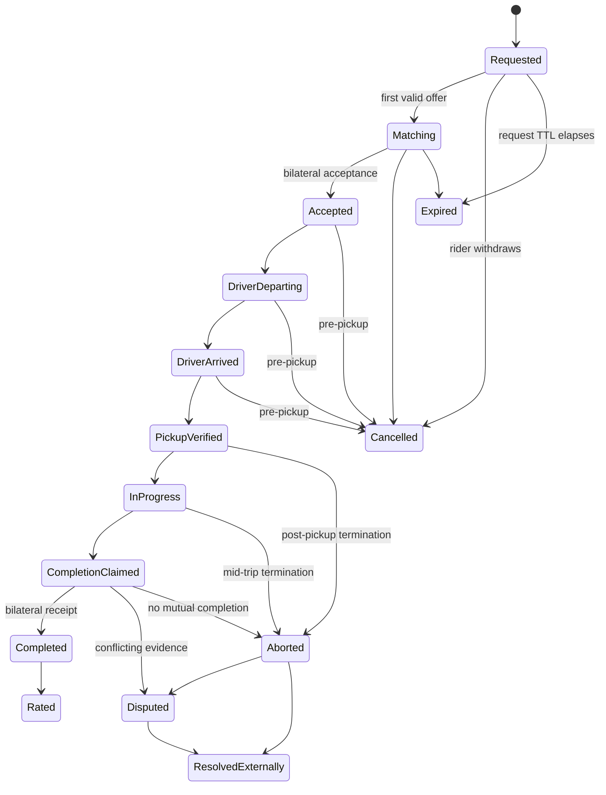

# PactRide

> An open, interoperable protocol for requesting, negotiating, verifying, and completing rides without requiring a single platform operator.

**Website:** https://wpgglabs.github.io/PactRide/  
**Founder vision:** [`FOUNDER_VISION.md`](FOUNDER_VISION.md)  
**Canonical status:** [`STATUS.md`](STATUS.md)  
**Maintenance posture:** [`MAINTENANCE.md`](MAINTENANCE.md)  
**Current stewardship:** [`MAINTAINERS.md`](MAINTAINERS.md)
**Independent review:** [`REVIEW_REQUEST.md`](REVIEW_REQUEST.md) and [`REVIEW_LOG.md`](REVIEW_LOG.md)

## The problem

Ride-hailing applications solved discovery and dispatch, then concentrated control over identity, pricing, reputation, customer relationships, and access to work. Drivers and riders cannot normally carry their history to another application. A platform can change fees, deactivate participants, alter pricing, or exit a market while retaining control of the network.

PactRide asks:

**What would ride coordination look like if dispatch worked more like email or the web—an open protocol implemented by many compatible applications—rather than a marketplace owned by one company?**

## The proposal

PactRide is a public protocol proposal, not a launched transportation service and not a claim that the safety, trust, adoption, operational, or legal problems are solved.

A compatible client should eventually be able to:

1. Create a user-controlled cryptographic identity.
2. Discover ride requests or driver availability through replaceable relays.
3. Publish only coarse, short-lived location information for discovery.
4. Negotiate exact locations, timing, price, and service terms through encrypted messages.
5. Verify pickup through a short code, QR exchange, or nearby-device handshake.
6. Record a signed ride lifecycle that distinguishes unilateral claims from bilateral proof.
7. Produce portable evidence another compatible client can validate under its own policy.
8. Preserve selected functions through direct or nearby connectivity during outages.
9. Let communities run their own relays, policies, moderation lists, and applications.
10. Allow transparent commercial, cooperative, nonprofit, municipal, and volunteer services without a mandatory protocol commission.

**Implementation path:** read the [`Implementer Guide`](IMPLEMENTATION_GUIDE.md), the [`Nostr transport profile`](NOSTR_PROFILE.md), the [`responsibility matrix`](RESPONSIBILITY_BOUNDARIES.md), and the complete [`end-to-end ride transcript`](examples/end-to-end-transcript.md).

Relays carry signed events but are not intended to become mandatory dispatch operators. Matching occurs in clients. Exact pickup, destination, contact, and negotiated terms remain encrypted until participants intentionally disclose them.

## What PactRide is

- An open protocol and public research project.
- A shared vocabulary, event model, schemas, and conformance work for interoperable ride applications.
- A place to examine technical, economic, safety, privacy, accessibility, and governance problems in public.
- A possible foundation for independent rider, driver, cooperative, municipal, nonprofit, and commercial clients.
- An internet-first design with nearby networking limited to verification and resilience.

## What PactRide is not

- Not an Uber clone.
- Not a finished application or active rideshare network.
- Not Bluetooth-only citywide dispatch.
- Not a blockchain, token, DAO, or cryptocurrency project.
- Not a promise of anonymous transportation without accountability.
- Not a central payment processor, insurer, emergency service, or global identity authority.
- Not a guaranteed zero-cost marketplace; optional services may charge transparent fees.
- Not a mechanism for one maintainer to control a worldwide transportation network.

## Design principles

1. **Protocol before platform** — interoperable events and conformance tests matter more than one polished client.
2. **User-held identity** — participants control their keys and can move between compatible clients.
3. **Data minimization** — public discovery must not expose exact pickup points, destinations, phone numbers, or continuous location.
4. **No canonical infrastructure** — relay and service providers must be replaceable.
5. **Plural trust** — communities may publish attestations and policies; no universal authority is required by the base protocol.
6. **Explicit limitations** — cryptographic proofs establish key authorization, not truth, safety, identity, payment, or legal compliance.
7. **No protocol tax** — payment remains method-neutral; the base protocol requires no platform currency, settlement provider, per-ride commission, or fee payable to PactRide.
8. **Progressive resilience** — internet-first functionality should work before experimental offline mesh routing is added.
9. **No hidden extraction** — compatible clients should disclose fees, ranking, routing choices, data handling, and third-party services.
10. **Forkability and succession** — the specification must survive the original maintainers.

See [`PRINCIPLES.md`](PRINCIPLES.md) and [`VISION.md`](VISION.md).

## Proposed architecture

The first practical implementation should use redundant internet relays for discovery and encrypted negotiation. Bluetooth should initially be limited to pickup verification and direct state exchange. Multi-hop device mesh is a later research track.

## Protocol lifecycle

PactRide separates the ride aggregate from each offer thread. Declining one driver's offer does not end the rider's whole request while other valid offers remain.

Ride-scoped transitions use deterministic event IDs, causal references, proof entries, and explicit expiry where applicable. One-sided completion remains a claim; only matching bilateral proofs create a portable completion receipt.

## Current status

**Founder-vision documentation: complete. Project maturity: pre-implementation research RFC with an initial machine-readable protocol core.**

The founder's current PactRide vision is fully represented in the repository, including scope, protocol behavior, schemas, lifecycle, privacy, safety, responsibility boundaries, economics, licensing, governance, maintenance, implementation guidance, and the future CommonPact relationship. See [`FOUNDER_VISION.md`](FOUNDER_VISION.md) for the bounded definition of completion.

This does not mean PactRide is implemented or production-ready. The repository does not contain a rider app, driver app, production relay, two-client interoperability proof, identity-verification service, emergency response, payment protection, insurance, or production safety guarantee.

Phase 0 founder-authored documentation is complete, while its external-review and maintainer-diversity exit criteria remain open. Phase 1 protocol-core artifacts exist, while independent interoperability evidence remains incomplete. See [`STATUS.md`](STATUS.md) for the exact evidence and remaining gates.

## Seeking maintainers and partners

PactRide is too large for one person to implement as a production transportation network. It is seeking:

- protocol and interoperability engineers;
- security and privacy researchers;
- mobile and relay developers;
- accessibility specialists;
- driver cooperatives and transportation nonprofits;
- universities and public-interest technology programs;
- municipal or institutional research partners;
- grant and sponsorship partners that do not control the protocol.

**Current maintainer:** `wpggLabs`. The founder maintains the completed initial vision, repository, and public record, but is not claiming to build or operate a production ride network alone.

Major implementation should resume only when there are committed maintainers, funded research, or a credible bounded pilot partner. Stars, forks, and general interest are not substitutes for implementation capacity. See [`MAINTAINERS.md`](MAINTAINERS.md) and [`MAINTENANCE.md`](MAINTENANCE.md).

## How to participate

Open an issue or RFC that:

- identifies a concrete privacy, safety, protocol, adoption, economic, accessibility, or interoperability failure;
- proposes a testable improvement with tradeoffs;
- supplies prior art or empirical evidence;
- implements an independent parser, validator, simulator, or conformance test; or
- documents a driver or rider workflow the protocol fails to represent.

The most useful contribution is a falsifiable criticism, reproducible test, independent implementation, or narrowly scoped protocol proposal.

New contributors can start with the repository's [good first issues](https://github.com/wpggLabs/PactRide/issues?q=is%3Aissue+is%3Aopen+label%3A%22good+first+issue%22). Protocol cryptography, identity, safety, and normative lifecycle work should not be treated as beginner tasks without maintainer guidance.

## Repository map

### Vision and status

- [`FOUNDER_VISION.md`](FOUNDER_VISION.md) — the bounded completion record for the initial founder vision.
- [`STATUS.md`](STATUS.md) — what exists, what remains unproven, and what comes next.
- [`VISION.md`](VISION.md) — long-term public-infrastructure thesis.
- [`PROBLEM_STATEMENT.md`](PROBLEM_STATEMENT.md) — failures PactRide attempts to address.
- [`PRINCIPLES.md`](PRINCIPLES.md) — design constraints.
- [`NON_GOALS.md`](NON_GOALS.md) — boundaries that prevent scope drift.
- [`MAINTENANCE.md`](MAINTENANCE.md) — limited-maintenance, inactivity, archival, and restart policy.

### Technical proposal

- [`ARCHITECTURE.md`](ARCHITECTURE.md)
- [`PROTOCOL.md`](PROTOCOL.md)
- [`RIDE_LIFECYCLE.md`](RIDE_LIFECYCLE.md)
- [`DISCOVERY_AND_MATCHING.md`](DISCOVERY_AND_MATCHING.md)
- [`TRANSPORTS.md`](TRANSPORTS.md)
- [`RELAY_NETWORK.md`](RELAY_NETWORK.md)
- [`OFFLINE_MESH.md`](OFFLINE_MESH.md)
- [`INTEROPERABILITY.md`](INTEROPERABILITY.md)
- [`IMPLEMENTATION_GUIDE.md`](IMPLEMENTATION_GUIDE.md)
- [`NOSTR_PROFILE.md`](NOSTR_PROFILE.md)
- [`RESPONSIBILITY_BOUNDARIES.md`](RESPONSIBILITY_BOUNDARIES.md)
- [`schemas/`](schemas/)
- [`test-vectors/`](test-vectors/)
- [`examples/`](examples/)

### Trust, privacy, and safety

- [`IDENTITY.md`](IDENTITY.md)
- [`TRUST_AND_REPUTATION.md`](TRUST_AND_REPUTATION.md)
- [`PRIVACY.md`](PRIVACY.md)
- [`THREAT_MODEL.md`](THREAT_MODEL.md)
- [`SECURITY.md`](SECURITY.md)
- [`FAILURE_MODES.md`](FAILURE_MODES.md)

### Stewardship and sustainability

- [`MAINTAINERS.md`](MAINTAINERS.md) — current founder, maintainers, decision authority, and succession.
- [`GOVERNANCE.md`](GOVERNANCE.md)
- [`ROADMAP.md`](ROADMAP.md)
- [`PRIOR_ART.md`](PRIOR_ART.md)
- [`LICENSING.md`](LICENSING.md) — Apache-2.0 scope and future official-software boundary.
- [`MONETIZATION.md`](MONETIZATION.md) — revenue compatible with an open protocol.
- [`TRADEMARK.md`](TRADEMARK.md)
- [`CONTRIBUTOR_POLICY.md`](CONTRIBUTOR_POLICY.md)
- [`CONTRIBUTING.md`](CONTRIBUTING.md)
- [`CODE_OF_CONDUCT.md`](CODE_OF_CONDUCT.md)
- [`FAQ.md`](FAQ.md)
- [`CITATION.cff`](CITATION.cff) — citation metadata for research and standards work.

## Future protocol-family research

PactRide may later inform a reusable **CommonPact** coordination core for discovery, private negotiation, bilateral agreement, lifecycle events, and portable evidence. That extraction is not stable or normative. PactRide remains self-contained until the proposed core works naturally for at least one substantially different domain, and transportation-specific safety behavior must remain outside any general core.

The dependency direction, candidate mapping, extraction criteria, and safety-preservation rules are defined in [`COMMONPACT_RELATIONSHIP.md`](COMMONPACT_RELATIONSHIP.md).

## License

The current PactRide specification repository is licensed under the **Apache License 2.0**. It permits commercial and noncommercial use, modification, distribution, and independent implementations subject to the license conditions. It does not require users or commercial operators to pay PactRide, share revenue, or publish modifications.

The Apache license does not grant permission to present a product as officially endorsed or certified by PactRide. Future official applications or hosted products may be developed in separate repositories under separately published software-license terms, but those terms cannot retroactively restrict released Apache-2.0 material or independent implementations of the protocol.

See [`LICENSE`](LICENSE), [`LICENSING.md`](LICENSING.md), [`MONETIZATION.md`](MONETIZATION.md), and [`TRADEMARK.md`](TRADEMARK.md).

## Maintainer statement

PactRide began from a driver's frustration with extractive platform economics. `wpggLabs` is the current maintainer. The maintainer's job is to keep decisions legible, preserve compatibility, expose unresolved problems, protect the protocol from hidden capture, and make it possible for future maintainers to continue the work without depending permanently on the founder.
