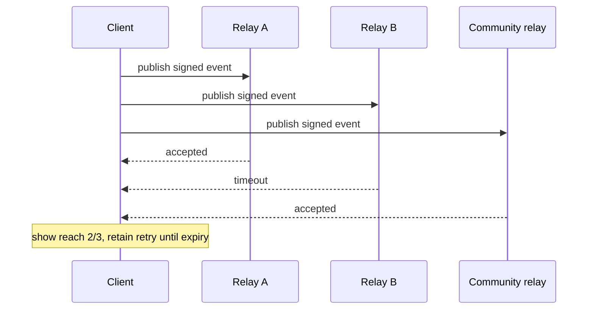

# Relay Network

## Role

Relays provide replaceable publish/subscribe transport. They are not authoritative dispatchers, identity providers, payment processors, or arbiters.

## Minimum relay capabilities

A relay used for PactRide discovery should support:

- Signed event publication.
- Subscription filters by kind, market, geohash, author, and time.
- Event size limits.
- Expiration hints.
- Authentication where private inbox access requires it.
- Rate limiting.
- Clear retention policy.

## Client relay set

A client should maintain:

- Several public relays.
- Optional community relays.
- Optional private inbox relays.
- Health and latency observations.
- Last successful publish/subscription timestamps.

No default relay list is permanent protocol infrastructure.

## Publication strategy

Clients should publish public discovery events to a configurable quorum and report partial reach.

## Relay discovery

Possible mechanisms:

- Application defaults.
- User-entered relay URLs.
- Community configuration bundles.
- Signed relay recommendations.
- Counterparty inbox relay declarations.

Recommendations are not trust guarantees. Clients should allow removal and replacement.

## Censorship detection

A client may compare event availability across relays. Evidence of selective omission should be presented carefully because network failure can resemble censorship.

## Retention

- Clients enforce event expiry independently.
- Relays should discard expired discovery events.
- Private encrypted inbox messages may have bounded retention.
- Permanent publication of raw trip history is discouraged.

## Relay economics

Relays cost money. Operators may use donations, community dues, public funding, subscriptions, or transparent usage fees. Charging for relay service does not violate protocol openness provided clients can choose alternatives and paid influence is disclosed.

## Privacy

Relays can observe IP addresses, timing, filters, and public event metadata. Private message content must remain encrypted. Clients may support Tor or other privacy transports but must not overstate anonymity.

## Community relays

A community relay may enforce membership, rate, or geography policies. Such a relay remains PactRide-compatible if it transports valid events and clearly documents local admission policy.

## Failure behavior

- Relay outage must not erase accepted local state.
- No single relay timestamp decides event order.
- Duplicate relay delivery must be harmless.
- Conflicting valid events must be preserved and evaluated by the ride state machine.
- Clients should support relay replacement without identity migration.

## Open questions

- Which Nostr NIPs form the minimum profile?
- Should PactRide define signed relay capability documents?
- How should public and private inbox relay sets differ?
- Can relay privacy be improved without fragmenting discovery?
- What health metrics can be shared without central telemetry?
