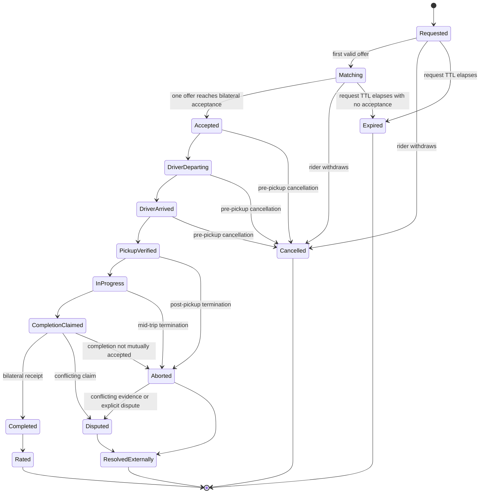
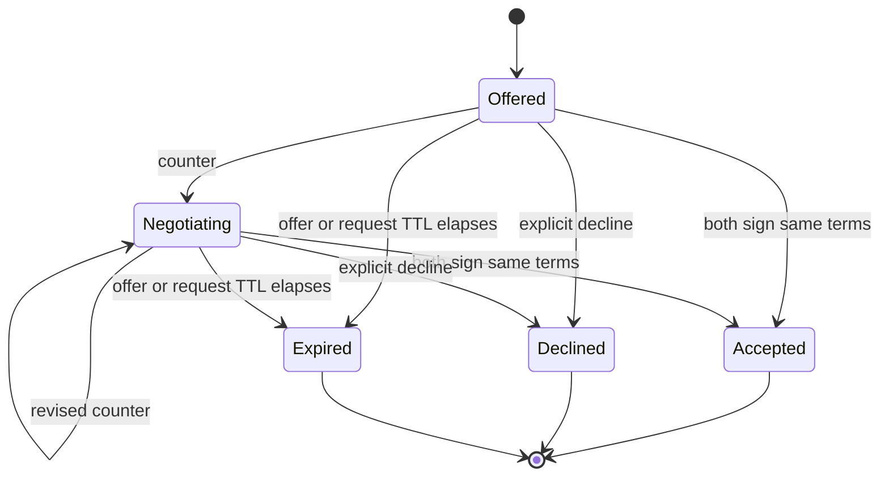

# Ride Lifecycle

## Goal

Define deterministic ride-level and negotiation-thread state machines that compatible clients can implement without relying on one dispatch server.

A single diagram previously mixed ride state with individual offer-thread state. This revision separates them so `Declined` and `Expired` have unambiguous meaning.

## Ride aggregate states

## Offer-thread states

Each driver offer has its own thread. Multiple offer threads can coexist under one ride request.

`Declined` and `Expired` are terminal for one offer thread. They do not terminate the ride aggregate while another valid offer thread remains.

## Ride aggregate rules

### Requested

Created by a rider or scheduled-ride initiator. Public request data is coarse and expiring.

Valid exits:

- `Matching`
- `Cancelled`
- `Expired`

### Matching

At least one valid offer thread exists, but no bilateral acceptance exists.

The aggregate remains `Matching` when an individual offer becomes `Declined` or `Expired`, provided another live offer remains.

Valid exits:

- `Accepted`
- `Cancelled`
- `Expired`

### Accepted

Both parties signed the same terms hash. The accepted object freezes:

- Rider and driver public keys.
- Price and currency.
- Settlement methods.
- Pickup time window.
- Cancellation terms, if any.
- Accessibility commitments.
- Vehicle summary or required category.
- Exact-location disclosure policy.

Only one accepted offer becomes the active ride path. If the rider bilaterally accepts multiple drivers, all acceptances remain cryptographically valid, but clients MUST display a conflicting-commitment warning.

### DriverDeparting / DriverArrived

Operational status messages. They are signed claims and do not prove physical movement or arrival.

### PickupVerified

Contains one bilateral pickup proof or an explicitly weaker policy substitute.

The canonical bilateral proof binds:

- Ride ID.
- Accepted rider key.
- Accepted driver key.
- Challenge hash.
- Verification method.
- Timestamp.

After this state, ordinary pre-pickup cancellation no longer applies. Termination uses `ride.abort`.

### InProgress

Begins after pickup verification and a valid `ride.started` event.

A community may require one or two start proofs, but the policy MUST be explicit. This variation does not change the bilateral proof requirements for pickup or completion.

### CompletionClaimed

One party claims completion. This is not a bilateral receipt and MUST NOT be displayed as mutually confirmed completion.

### Completed

Both accepted parties sign one identical `ride.completed.receipt`. This produces the primary portable ride receipt.

### Aborted

A participant terminated the ride after pickup verification or after the ride started.

`Aborted` records an abnormal end without determining fault. It preserves:

- Last mutually recognized state.
- Aborting actor.
- Reason category.
- Timestamp.
- External-help indicator.
- Related unilateral claims.

An abort does not automatically create a portable successful-ride receipt.

### Disputed

Used when:

- Completion claims conflict.
- One party rejects a completion claim.
- Abort and completion events conflict.
- Parties disagree about the last valid state.

The base protocol preserves evidence but does not choose an arbitrator.

### Cancelled

Terminal ride aggregate state before pickup verification.

A cancellation after accepted terms remains evidence-bearing and may have local settlement consequences, but the base protocol imposes no fee.

### Expired

A deterministic derived terminal state when the request TTL elapses before bilateral acceptance.

Rules:

- Expiry is calculated as `created_at + ttl_seconds`.
- No signed `ride.expired` event is required.
- Late relay delivery cannot revive the request for live matching.
- Clients MAY archive the expired request.
- An acceptance completed before expiry remains valid even if delivered later, provided causal proofs and timestamps validate under the accepted clock-skew policy.
- A new attempt requires a new request event and new ride ID.

### Rated

One or both parties issued receipt-linked ratings. Rating does not alter the completed receipt.

### ResolvedExternally

An external community, legal, insurance, cooperative, or private process recorded a resolution reference.

PactRide records the reference as a claim; it does not make the external body protocol authority.

## Offer-thread rules

### Offered

One encrypted driver offer exists. An offer is not acceptance.

Valid exits:

- `Negotiating`
- `Accepted`
- `Declined`
- `Expired`

### Negotiating

The parties exchange complete proposed terms.

Each counter supersedes only the immediately referenced proposal in that offer thread. A client MUST NOT infer agreement from similar but differently hashed terms.

Valid exits:

- `Negotiating`
- `Accepted`
- `Declined`
- `Expired`

### Declined

Created by `ride.decline`.

Rules:

- It closes only the referenced offer thread.
- It MUST reference the current offer or counter.
- It MUST identify the declining actor.
- It MUST NOT cancel another driver’s offer.
- It MUST NOT terminate an already accepted ride; post-acceptance termination uses `ride.cancel` or `ride.abort`, depending on phase.

### Offer Expired

Derived when either:

- The offer’s own TTL elapses, or
- The parent request expires before acceptance.

It is terminal for that offer thread.

## Conflict matrix

| Situation | Required behavior |
|---|---|
| Two driver offers | Keep separate offer threads; ride aggregate is `Matching` |
| One offer declined, another live | Keep ride aggregate `Matching` |
| All offers declined, request live | Return aggregate display to `Requested`/awaiting offers |
| Request TTL elapses without acceptance | Aggregate becomes `Expired`; all unaccepted threads become `Expired` |
| Accept crosses a newer counter | No agreement; accepted hash is stale |
| Both parties accept different terms | No agreement |
| Rider accepts two drivers | Preserve both; warn of conflicting commitments |
| Driver cancels after acceptance but before pickup | Preserve accepted terms and cancellation; aggregate becomes `Cancelled` |
| Either party terminates after pickup proof | Emit `ride.abort`; aggregate becomes `Aborted` |
| Abort conflicts with completion claim | Preserve both; aggregate becomes `Disputed` |
| One party claims completion | Show `CompletionClaimed`, not `Completed` |
| Parties claim different completion facts | Aggregate becomes `Disputed` |
| Relay delivers old event last | Use references and state rules, not arrival order |
| Duplicate event from multiple relays | Deduplicate by event ID |
| Event arrives after effective expiry | Reject for live state; optionally archive |

## Cancellation before pickup

`ride.cancel` applies only before `PickupVerified`.

It SHOULD contain:

- Actor.
- Referenced current state.
- Timestamp.
- Machine-readable reason category.
- Optional encrypted note.

Suggested categories:

- `changed_mind`
- `counterparty_no_show`
- `unsafe_situation`
- `vehicle_issue`
- `route_or_terms_changed`
- `duplicate_commitment`
- `technical_failure`
- `other`

## Abnormal termination after pickup

`ride.abort` applies from `PickupVerified`, `InProgress`, or `CompletionClaimed`.

It MUST contain:

- Actor.
- Reference to the last recognized state.
- Timestamp.
- Reason category.
- `external_help_requested` boolean.
- Optional encrypted note.

Suggested categories:

- `unsafe_situation`
- `medical_event`
- `vehicle_failure`
- `route_blocked`
- `counterparty_requested_stop`
- `terms_dispute`
- `technical_failure`
- `other`

The protocol does not assign fault, emergency response, refund, insurance coverage, or legal status.

## Time and clock skew

Clients SHOULD tolerate modest clock skew for message ordering but MUST use causal references rather than timestamp alone.

Expiry uses the request creator’s signed `created_at + ttl_seconds`. Conformance profiles MUST define an allowed skew window and overflow-safe integer behavior.

Security-sensitive proofs SHOULD include nonces and monotonic local sequencing where possible.

## Offline behavior

A transition created offline may be queued and delivered later. Clients must display that remote acknowledgement is pending.

An offline event does not become mutually accepted until required counterpart proofs exist.

## Data retention

- Public discovery events: short-lived and safe to discard after expiry.
- Negotiation: retained locally according to user policy.
- Accepted terms and pickup/completion receipts: retained for portability and dispute evidence.
- Abort and dispute evidence: retained according to explicit local policy.
- Live location samples: local and ephemeral by default; never required for a valid receipt.

## Open questions

- Should `ride.started` require both signatures?
- How should shared rides with multiple riders extend bilateral state?
- Should recurring rides use a parent agreement plus child ride IDs?
- What minimal evidence should a rating require?
- How should accessibility failures be represented without exposing sensitive health information?
