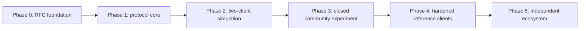

# PactRide Roadmap

## Operating rule

PactRide advances only when each phase produces evidence that justifies the next. Dates are intentionally omitted until contributors and maintainers exist.

Founder-authored documentation completion and roadmap phase completion are different concepts. The initial founder vision is fully documented, but Phase 0 remains open until external-review and maintainer-diversity exit criteria are met.

## Current position

PactRide currently overlaps Phase 0 and Phase 1.

- The complete initial founder vision, RFC, governance, safety, privacy, licensing, website, CommonPact boundary, and issue foundation exist.
- Deterministic event-ID rules, strict schemas, bilateral proof representation, lifecycle corrections, test vectors, and automated protocol-artifact validation exist.
- Phase 0 founder-authored deliverables are present, but external-review, critical-objection, and maintainer-diversity exit criteria are not complete.
- Phase 1 encryption, relay-profile, full state-fixture, cross-language, independent-parser, security-review, and two-client evidence are not complete.
- No client simulation, mobile application, pilot, or production hardening has begun.

See [`FOUNDER_VISION.md`](FOUNDER_VISION.md) for the bounded documentation-completion record and [`STATUS.md`](STATUS.md) for the canonical evidence snapshot.

## Phase 0 — Public RFC foundation

### Founder-authored deliverables

- Vision, principles, and non-goals. **Complete**
- Problem statement and prior-art review. **Complete initial record; prior art remains ongoing**
- Threat, privacy, failure, and responsibility models. **Complete initial record; review remains ongoing**
- Draft event envelope and ride lifecycle. **Present**
- Governance, contribution, maintenance, and succession process. **Present**
- Licensing, monetization, trademark, and official-status boundaries. **Present**
- CommonPact relationship and extraction boundary. **Present and explicitly non-dependent**
- Open research issues. **Present**
- Public discovery website. **Present**
- Founder-vision completion record. **Present**

### Exit criteria

- At least five substantive external reviews. **Not met**
- Critical objections are recorded, not hidden. **Process present; ongoing**
- Scope is understood as protocol research, not a launched service. **Publicly stated**
- Maintainers identify the first three RFCs requiring decisions. **Issues identified; decisions incomplete**
- At least one additional sustained maintainer or institutional research partner participates. **Not met**

## Phase 1 — Machine-readable protocol core

### Deliverables

- Canonical serialization and event-ID decision. **Initial v0.1 decision present**
- Strict event and public-request schemas. **Initial schemas present**
- Uniform single-party and bilateral proof representation. **Present**
- Signature profile. **Partially specified; independent verification incomplete**
- Encryption profile. **Initial NIP-17/NIP-44-v2/NIP-59 profile present; independent implementation evidence incomplete**
- Test vectors. **Initial event-ID and regression vectors present**
- State-machine fixtures. **Initial executable normal and failure scenarios present; cryptographically complete cross-client coverage incomplete**
- Public-request privacy validator. **Initial validator present**
- Relay interoperability profile. **Initial carrier, inbox, authentication, retry, and capability rules present; relay test matrix incomplete**
- Project and website consistency validation. **Initial validation present**

### Exit criteria

- Two independent parsers produce identical event IDs. **Not met**
- Invalid transitions and stale accepts are rejected consistently. **Not independently demonstrated**
- Public fixtures contain no exact locations or contact fields. **Current fixtures validated**
- Security review finds no unresolved critical cryptographic design error. **Not met**
- Two languages validate the same envelope and event-ID vectors. **Not met**

## Phase 2 — Independent client simulation

### Deliverables

- Minimal command-line rider client.
- Independently implemented minimal driver client in a different language.
- Multi-relay test environment.
- Full request → offer → counter → bilateral accept → pickup proof → completion claim/receipt flow.
- Cancellation, expiry, abort, dispute, and conflict flows.
- Failure simulations for relay loss, replay, duplicate delivery, and crossing messages.

### Exit criteria

- Clients written by different contributors interoperate.
- No canonical PactRide server is required.
- Exported receipt validates in both clients.
- Relay failure does not destroy an accepted ride state.
- Both clients distinguish one-sided claims from bilateral evidence.

## Phase 3 — Closed community experiment

Not a public launch. A small, pre-existing, consenting community tests usability and protocol behavior without representing the system as production-safe.

### Deliverables

- Mobile proof-of-concept.
- Community relay option.
- Local trust policy.
- Attestation and revocation prototype.
- Incident and feedback process.
- Privacy and safety consent materials.
- Named operational, legal, and insurance responsibility for the experiment.

### Exit criteria

- Participants understand public versus encrypted data.
- No critical location leak is observed.
- Delivery reliability and battery impact are measured.
- Community can operate without daily intervention from the original founder.
- Stop conditions and incident ownership are tested.

## Phase 4 — Hardening

### Deliverables

- Reproducible builds.
- Hardware-backed key storage.
- Independent mobile security audit.
- Accessibility review.
- Localization framework.
- Abuse and Sybil simulation.
- Signed release process.
- Software bill of materials.
- Optional BLE pickup verification.
- Documented migration and recovery procedures.

### Exit criteria

- Critical audit findings resolved.
- Recovery and rotation behavior tested.
- Threat-model claims tied to measured evidence.
- At least one community policy and one public policy implementation coexist.
- No hidden mandatory service exists in the reference stack.

## Phase 5 — Ecosystem independence

### Deliverables

- Multiple production-quality clients maintained by separate groups.
- Multiple relay implementations and operators.
- Published conformance suite.
- Public RFC registry.
- Maintainer succession process.
- Formal specification release.

### Success criteria

- No single client controls most protocol decisions.
- Users can move identity and receipts between clients.
- Users can choose between transparent service providers without losing protocol access.
- No protocol-level commission or tax is required.
- The original repository can disappear without terminating the network.

## Parallel research tracks

- Rotating discovery identities and selective disclosure.
- Accessible ride requirements.
- Group and shared-ride state machines.
- Scheduled and recurring rides.
- Community attestation vocabularies.
- Privacy-preserving anti-Sybil methods.
- BLE and opportunistic courier transport.
- Payment and settlement extension profiles.
- Safety reporting without centralized surveillance.
- Transparent fee and ranking disclosure.
- Legal and insurance boundaries for community experiments.
- CommonPact abstraction tests in a substantially different domain, without making PactRide dependent on unfinished generic work.

## Stop conditions

The project should pause or narrow scope if:

- Independent clients cannot interoperate without a de facto central server.
- Public discovery cannot meet acceptable location-privacy requirements.
- The safety language materially overstates protocol guarantees.
- Maintainers become the sole trusted identity, certification, payment, or relay authority.
- Monetization makes base protocol access dependent on the founder or one company.
- Contributors primarily pursue tokens, speculation, or proprietary lock-in.
- No community demonstrates interest after a complete, reviewable RFC foundation.
- CommonPact abstraction work begins overriding transportation-specific requirements without multi-domain evidence.