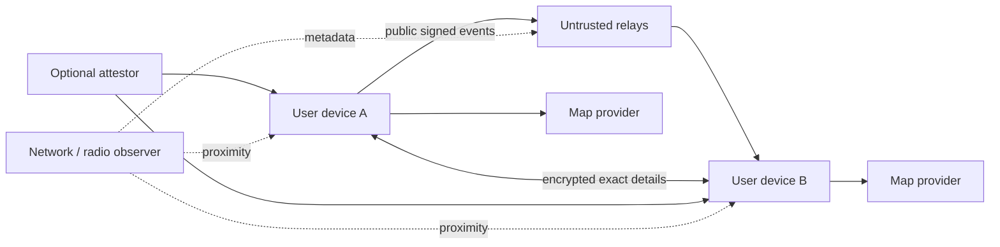

# Threat Model

## Purpose

This document identifies adversaries, abuse paths, mitigations, and residual risk. It is not a claim that PactRide is safe for public deployment.

## Assets

- Private identity keys.
- Exact pickup and destination details.
- Live location.
- Accepted ride terms.
- Portable reputation evidence.
- Contact and vehicle information.
- Local moderation lists.
- Payment or settlement evidence.
- Safety-related reports.

## Adversaries

### Opportunistic spammer

Publishes fake requests or offers to waste time, harvest contact details, or overwhelm relays.

### Sybil attacker

Creates many identities to manipulate discovery, ratings, trust graphs, or community voting.

### Stalker or harasser

Uses ride requests, exact locations, contact exchange, or repeat interactions to target a person.

### Fraudulent rider

Attempts nonpayment, false complaints, chargeback abuse, property theft, or coordinated rating attacks.

### Fraudulent driver

Misrepresents identity or vehicle, demands changed terms, collects information without arriving, or fabricates completion.

### Malicious relay

Drops, delays, reorders, selectively censors, correlates, or retains events.

### Compromised client

Leaks private keys, exact locations, history, or decrypted messages through malware, analytics, logs, or supply-chain compromise.

### Colluding reputation farm

A group repeatedly signs fake rides and ratings to manufacture trust.

### Physical attacker

Coerces a participant, steals a device, scans a pickup code, or acts outside what protocol evidence can observe.

## Trust-boundary diagram

## Threats and mitigations

### Public location harvesting

**Threat:** an observer collects ride requests to infer where people live, work, worship, or travel.

**Mitigations:**

- Coarse geohashes.
- Short expirations.
- Rotating discovery keys.
- Optional destination suppression.
- No exact coordinates in public schema.
- Client-side neighbor-cell matching.

**Residual risk:** repeated coarse requests can still be correlated.

### Fake identity and Sybil attacks

**Threat:** unlimited keys create false demand, offers, reviews, or trust.

**Mitigations:**

- Rate limits per relay.
- Optional proof-of-work for unknown identities.
- Key-age signals.
- Community attestations.
- Completed-ride receipts.
- Distinct-counterparty weighting.
- Local trust thresholds.

**Residual risk:** determined attackers can acquire aged keys, collude, or pay for attestations.

### Reputation farming

**Threat:** colluding identities manufacture completed rides and positive ratings.

**Mitigations:**

- Devalue repeated rides among the same small cluster.
- Analyze diversity without publishing a universal score.
- Preserve raw signed receipts.
- Allow community-specific trust analysis.
- Flag implausible timing and geographic patterns locally.

**Residual risk:** sophisticated farms may mimic real activity.

### Relay censorship or manipulation

**Threat:** a relay hides certain drivers, regions, or communities.

**Mitigations:**

- Publish to multiple relays.
- Compare relay observations.
- Self-hosted community relays.
- Client-visible relay configuration.
- No relay-authoritative ordering.

**Residual risk:** users with limited network access may still depend on a narrow relay set.

### Message replay and stale state

**Threat:** old offers, accepts, or cancellation events are replayed to create confusion.

**Mitigations:**

- Event IDs and deduplication.
- Expiration.
- Causal references.
- Terms hashes.
- Ride-state validation.

### Contact harvesting

**Threat:** fake offers obtain phone numbers, exact addresses, or vehicle details.

**Mitigations:**

- Delay contact disclosure.
- Use in-protocol encrypted communication first.
- Reveal exact data only after policy thresholds or bilateral acceptance.
- Limit negotiation rounds.

### Pickup impersonation

**Threat:** an attacker claims to be the selected driver or rider.

**Mitigations:**

- QR/phrase challenge tied to both keys and ride ID.
- Optional BLE proximity handshake.
- Display verified vehicle/person evidence.
- Require bilateral pickup proof before high-confidence start.

**Residual risk:** device theft, coercion, or visual similarity remain physical-world risks.

### One-sided completion fraud

**Threat:** a participant claims a ride happened or payment was made.

**Mitigations:**

- Distinguish claim from bilateral receipt.
- Require both signatures for high-confidence completion.
- Preserve conflicting claims.
- Do not infer payment finality without method-specific proof.

### Client supply-chain compromise

**Threat:** a malicious dependency or update steals keys or locations.

**Mitigations:**

- Reproducible builds.
- Signed releases.
- Minimal dependencies.
- Hardware-backed keys.
- Permission minimization.
- Independent audits.
- Software bill of materials.

### Denial of service

**Threat:** spam exhausts relay, bandwidth, battery, or client attention.

**Mitigations:**

- Expiration.
- Size limits.
- Rate limits.
- Local filtering.
- Topic/geohash partitioning.
- Bounded BLE TTL and deduplication.
- Optional community admission controls.

### Discriminatory filtering

**Threat:** clients or communities use trust and profile data to discriminate.

**Mitigations:**

- Minimize public profile fields.
- Make ranking rules inspectable.
- Avoid protocol-required protected-characteristic fields.
- Document local policy separately from protocol.

**Residual risk:** an open protocol cannot force every client to behave fairly.

## Safety claims the protocol must not make

PactRide cannot prove:

- A real-world person matches a key.
- A vehicle is currently safe.
- A background check is complete or truthful.
- A participant is not armed or violent.
- A route was followed.
- A cash payment occurred.
- Emergency help will arrive.
- A signed rating is honest.

## Deployment gates

Before any public pilot, require:

1. Independent cryptographic review.
2. Mobile application security review.
3. Abuse simulation with large Sybil populations.
4. Location-correlation analysis.
5. Relay outage and censorship testing.
6. Pickup impersonation tests.
7. Clear user-facing risk language.
8. Incident-response ownership for the pilot community.
9. No claim of production safety based solely on protocol completion.
