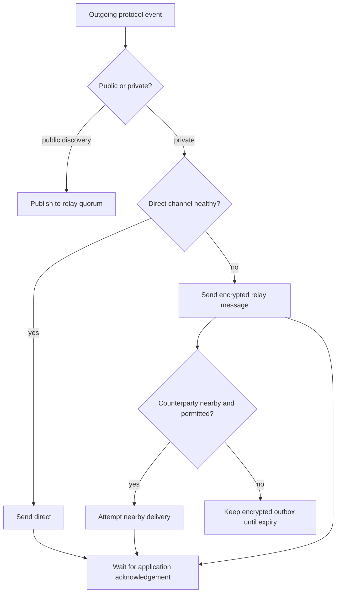

# Transports

## Principle

PactRide application events should remain valid regardless of whether they travel through public relays, a direct encrypted connection, Bluetooth, Wi-Fi Direct, or an encrypted store-and-forward queue.

A transport delivers bytes. It does not decide whether an offer was accepted, a pickup happened, or a ride completed.

## Common interface

A reference transport abstraction should expose operations similar to:

```text
publish(event, destinations, expiry)
subscribe(filters)
send_private(envelope, recipient)
acknowledge(message_id)
observe_delivery_state(message_id)
close()
```

Required delivery states:

- `created`
- `queued`
- `submitted`
- `accepted_by_transport`
- `received_by_peer`
- `decrypted_by_peer`
- `application_acknowledged`
- `expired`
- `failed`

Clients must not label a transport submission as peer acceptance.

## Relay transport

### Role

Default city-scale discovery and asynchronous private delivery.

### Expected properties

- Publish signed events to several relays.
- Subscribe through region, market, event-kind, and time filters.
- Deduplicate identical events.
- Enforce local expiration.
- Treat relay ordering as untrusted.
- Continue when some relays fail or censor.

### Limitations

- Relays observe connection metadata.
- Relay sets must overlap for discovery.
- Public events may be retained indefinitely.
- Relays can drop, delay, or selectively serve events.

## Direct encrypted transport

After negotiation begins, clients may establish a direct channel through WebRTC, QUIC, Noise, or another authenticated encrypted protocol.

Uses:

- Faster negotiation.
- Arrival and trip-state updates.
- Optional live location.
- Reduced relay metadata.

A direct channel still requires fallback because NAT, firewalls, mobile suspension, and connectivity changes can break it.

## Nearby transport

Bluetooth Low Energy or platform nearby APIs may support:

- Pickup challenge exchange.
- Mutual proximity confirmation.
- Short ride-state messages.
- Delivery during temporary internet failure.

Nearby presence is not identity proof. An authenticated challenge must bind the radio session to the selected ride and keys.

## Store and forward

Clients should maintain an encrypted outbox for undelivered private events.

Each queued item contains:

- Message ID.
- Recipient key.
- Expiry.
- Allowed transports.
- Attempt count.
- Last attempt.
- Ciphertext only.

Retry must be bounded. A client must show when a message remains unacknowledged.

## Transport selection



## Delivery quorum

For public requests, a client may consider the event available after a configurable relay quorum acknowledges storage. The UI should show the number of successful relays and warn when discovery has limited reach.

## Message size limits

The base protocol should keep events small. Suggested initial limits:

- Public discovery event: 8 KiB.
- Private negotiation envelope: 16 KiB.
- State transition: 8 KiB.
- Attestation: 16 KiB.
- No inline photos, identity documents, or large media.

Large encrypted attachments should use separate content-addressed storage with explicit consent.

## Transport downgrade risks

An attacker may block a preferred transport and force a less private one. Clients should:

- Display the active transport.
- Preserve end-to-end encryption on every path.
- Never disclose additional plaintext because of fallback.
- Allow users or communities to disable transports.

## Background behavior

Mobile operating systems limit indefinite scanning, sockets, and background execution. Implementations should use platform-supported push or scheduled wake mechanisms while documenting metadata and availability tradeoffs.

PactRide must not promise always-on peer routing from ordinary phones.

## Conformance tests

- Same signed event survives relay, direct, and nearby encoding round trips.
- Duplicate delivery does not duplicate state.
- Transport reordering does not alter causal state.
- Expired queue entries are removed.
- Failed direct connection falls back without plaintext leakage.
- Pickup challenge cannot be replayed across ride IDs.
