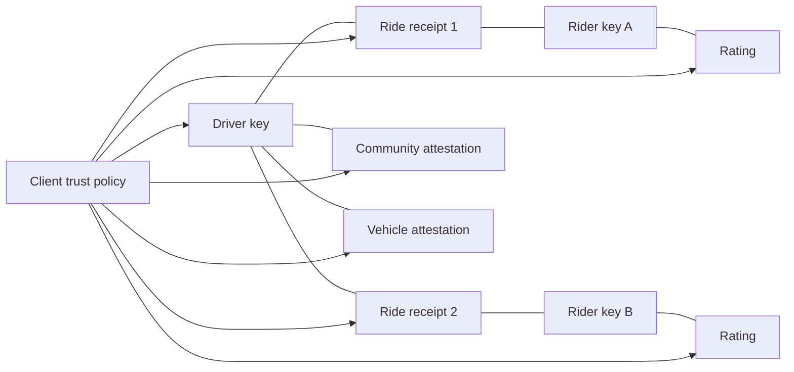

# Trust and Reputation

## Position

PactRide should not create one universal reputation score. A score controlled by the protocol maintainers would reproduce centralized platform power and hide important context.

Instead, clients evaluate portable, signed evidence under a local policy.

## Evidence types

### Key continuity

- Key creation date, where observable.
- Signed key-rotation history.
- Recovery attestations.
- Number of days or months the identity has participated.

Key age is weak evidence. Old keys can be sold or compromised.

### Bilateral ride receipts

A high-confidence receipt is signed by both rider and driver and binds:

- Ride ID.
- Accepted terms hash.
- Pickup proof hash.
- Start and completion timestamps.
- Coarse completion zone.
- Optional settlement declaration.

Receipts prove that two keys agreed to a record. They do not prove every physical claim is true.

### Ratings

Ratings should reference a receipt and contain structured dimensions. Clients should distinguish:

- Receipt-backed rating.
- Rating attached to unilateral completion claim.
- Unlinked opinion or moderation report.

### Attestations

An attestor signs a claim about a subject key. Examples:

- Community membership.
- Driver cooperative membership.
- Vehicle inspection observed on a date.
- Training completed.
- Credential checked.
- Identity checked in person.
- Accessibility equipment observed.

The protocol transports the claim, issuer, issue date, expiry, scope, and revocation reference. It does not decide which issuers are trustworthy.

### Warnings and blocks

A user or community may publish or locally store warnings. Because such reports may be false, retaliatory, or sensitive, clients must preserve provenance and confidence level.

## Evidence graph



## Local trust policy

A client may evaluate evidence using rules such as:

- Require one accepted community attestation.
- Require at least three receipts from distinct counterparties.
- Warn when a key is less than seven days old.
- Discount repeated rides between the same two keys.
- Exclude expired or revoked vehicle attestations.
- Surface unresolved disputes.

The policy should be inspectable and exportable. Users should be able to see why a counterparty is shown as trusted, unknown, or risky.

## Avoiding a hidden global score

Clients MUST NOT represent a locally computed number as an objective protocol score. If a score is shown, it should include:

- The policy or algorithm version.
- Evidence considered.
- Evidence excluded.
- Date calculated.
- Whether the calculation occurred locally or through a service.

## Sybil and collusion resistance

No single technique solves Sybil attacks. PactRide should combine:

- Relay rate limits.
- Optional proof-of-work.
- Key age.
- Distinct counterparties.
- Graph diversity.
- Community attestations.
- Receipt timing plausibility.
- Geographic plausibility.
- Local allowlists for closed communities.

Repeated interactions remain valid but should contribute diminishing evidence of broad trust.

## Privacy-preserving disclosure

A participant may not want to publish their full ride graph. Future research should examine:

- Selective disclosure of a subset of receipts.
- Merkle commitments to receipt collections.
- Zero-knowledge proofs for statements such as “at least 20 valid receipts” without revealing counterparties.
- Anonymous credentials issued by communities.

These are future extensions, not v0.1 requirements.

## Attestation schema

```json
{
  "type": "identity.attestation",
  "issuer": "pubkey:community-a",
  "subject": "pubkey:driver-x",
  "issued_at": 1783742400,
  "expires_at": 1815278400,
  "claims": [
    {
      "name": "community-membership",
      "value": "active",
      "method": "in-person-check"
    }
  ],
  "evidence_uri": null,
  "revocation_ref": "pactride:revocations:community-a"
}
```

Sensitive source documents should not be embedded in public attestations.

## Revocation

Attestors must be able to revoke claims. Clients should fetch or subscribe to revocation events and show stale status when they cannot confirm current validity.

## Disputes

A dispute is evidence, not automatic guilt. Clients should display:

- Who made the claim.
- Which ride receipt or event it references.
- Whether the counterparty responded.
- Whether a community process produced an outcome.
- Whether the outcome is accepted by the user's local trust policy.

## Open questions

- How can clients detect receipt farms without central surveillance?
- Should attestors use standardized claim vocabularies?
- How can a user migrate reputation after complete key loss?
- How should harmful false reports be corrected while preserving audit history?
- Which privacy-preserving proof systems are practical on mobile devices?
