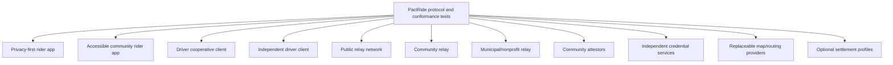

# PactRide Vision

## One-sentence vision

PactRide aims to make ride coordination an interoperable public protocol so no single application must own discovery, identity, reputation, pricing access, or the relationship between a driver and rider.

## Why this project exists

Ride-hailing platforms demonstrated that software can coordinate millions of independent drivers and riders. The technical achievement is real. The structural problem is that the coordination layer is commonly inseparable from a privately owned marketplace.

A platform may control:

- Who can participate.
- Which rides are visible.
- How offers are ranked.
- How prices, commissions, and deductions are represented.
- Which identity or safety evidence counts.
- Whether reputation can leave the platform.
- Whether drivers and riders may maintain direct repeat relationships.
- Which maps, payment processors, and support systems are mandatory.
- Whether a market remains available.

PactRide proposes separating the shared coordination language from any one operator.

## The public-protocol thesis

Email is not one company. The web is not one browser. A person can change applications or providers while retaining the ability to communicate through shared standards.

Ride coordination should be able to develop similar properties:

- A rider application developed by one community can communicate with a driver application developed by another.
- A cooperative relay can coexist with public and nonprofit relays.
- A participant can retain keys and verifiable history when changing clients.
- A map, payment, identity, or moderation service can be replaced without replacing the entire network.
- Local communities can use stricter participation policies without changing the base ride language.
- Drivers and riders can choose software and service providers without losing protocol access.
- The protocol can continue if the original founder, repository, or reference client disappears.

This does not imply that transportation is as simple as email. Physical safety, local density, accessibility, insurance, disputes, and operations remain difficult. The purpose of an open protocol is not to deny those problems; it is to prevent one private platform from being the only possible place to solve them.

## What a mature ecosystem could contain

No component in this diagram is required to be operated by PactRide maintainers.

## User sovereignty

A participant should be able to control:

- Identity keys.
- Recovery method.
- Public discovery exposure.
- Exact-location disclosure timing.
- Relay selection.
- Trust and moderation policy.
- Which evidence to show a counterparty.
- Preferred drivers or riders.
- Payment method.
- Export of receipts and attestations.
- Deletion of local history, subject to the limits of data already shared.

Sovereignty does not mean every choice is risk-free. Clients must explain consequences and communities may require policies for participation.

## Economic neutrality

PactRide does not require one economic model. Compatible services may be funded through:

- Driver or community dues.
- Subscriptions.
- Donations.
- Municipal or nonprofit funding.
- Transparent hosting fees.
- Paid support.
- Payment-processing fees.
- Commercial applications.
- Volunteer operation.

The base protocol must not impose a mandatory per-ride commission, protocol tax, required payment processor, or fee payable to the original founder. The protocol opposes mandatory hidden extraction, not every exchange of money. Optional services may charge for real value, but fees must be visible and users must remain able to choose competing clients and infrastructure.

The economic objective is not to promise that every ride is free. It is to prevent access to the shared coordination language from being conditioned on one operator's opaque deductions or permission.

## Safety and trust vision

The project rejects two extremes:

1. A single global platform must decide who is trustworthy.
2. Cryptographic pseudonyms make trust and accountability unnecessary.

PactRide instead proposes plural, inspectable trust:

- Users control keys.
- Rides can produce bilateral signed receipts.
- Communities can issue scoped attestations.
- Credentials expire and can be revoked.
- Clients evaluate evidence under transparent local policy.
- Disputes and conflicting claims remain visible.
- No universal “verified safe” status is created by the base protocol.

## Privacy vision

A relay should not need an exact address to help discover a potential match. Public events should be coarse, short-lived, and unlinkable where practical. Exact addresses, contact details, route information, and negotiation belong in encrypted channels.

Privacy is not anonymity theater. Network metadata, map requests, radio proximity, and counterparty disclosure still create risk. The project must document these limits.

## Resilience vision

PactRide should work through replaceable internet relays first. Direct encrypted channels and nearby networking provide additional resilience. Bluetooth mesh may help during outages or physical pickup, but ordinary phones cannot guarantee a continuous citywide mesh.

The project values measured reliability over claims of being “unstoppable.”

## Founder role

The founder's role is to:

- Articulate the initial problem.
- Organize research and prior art.
- Create a coherent first specification draft.
- Recruit criticism and independent contributors.
- Keep decisions public.
- Prevent premature claims.
- Develop optional software, services, and expertise that can fund stewardship without owning protocol access.
- Transfer protocol authority as the contributor base grows.

The founder should not become a permanent network owner, mandatory relay operator, global verifier, sole protocol gatekeeper, or recipient of a mandatory fee from every compatible ride.

## Long-term success

PactRide succeeds when:

- Independent implementations interoperate.
- Drivers and riders can move between clients without losing identity and evidence.
- Drivers and riders can understand fees and choose between service providers.
- Several communities operate without one mandatory service.
- Safety and privacy limitations remain explicit.
- Protocol evolution includes people affected by transportation systems.
- The original founder can leave without ending the project.

## Near-term mission

The current mission is not to launch rides. It is to produce a specification precise enough that serious engineers, security researchers, drivers, riders, accessibility specialists, and community operators can identify what works, what fails, and what should be built next.