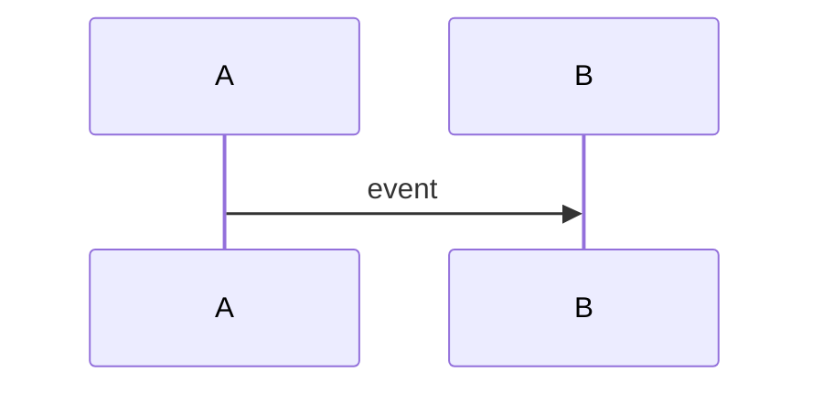

# RFC 0000: Title

- **Status:** Draft
- **Authors:**
- **Created:** YYYY-MM-DD
- **Discussion:** issue/URL
- **Target protocol version:**
- **Supersedes:** none

## Summary

One paragraph describing the proposed change.

## Problem

Describe the user or interoperability problem without assuming the proposed solution.

## Goals

- Goal 1
- Goal 2

## Non-goals

- Non-goal 1
- Non-goal 2

## User stories

- As a rider...
- As a driver...
- As a client implementer...
- As a relay operator...

## Normative specification

Use MUST, SHOULD, and MAY precisely. Define event fields, validation, state transitions, errors, and expiration.

## Data model

Include JSON examples and schema changes.

## Sequence or state diagram

## Privacy analysis

- Publicly visible data.
- Counterparty-visible data.
- Relay/network metadata.
- Correlation risks.
- Retention and deletion limitations.

## Threat analysis

- New attack paths.
- Abuse controls.
- Residual risk.
- Failure behavior.

## Accessibility impact

Describe whether the proposal affects screen readers, motor accessibility, hearing, language, cognitive load, or accessible ride representation.

## Compatibility

- Backward compatibility.
- Unknown-field behavior.
- Version negotiation.
- Migration.
- Downgrade risks.

## Alternatives considered

Include keeping the current behavior.

## Test plan

- Valid fixtures.
- Invalid fixtures.
- Cross-client tests.
- Failure simulations.
- Privacy lint checks.

## Reference implementation

State whether an implementation exists. Provisional specification approval does not require declaring production readiness.

## Deployment and rollback

Describe how experiments can be stopped without corrupting identity or ride history.

## Open questions

List unresolved decisions explicitly.

## Decision record

Completed by maintainers after review.
